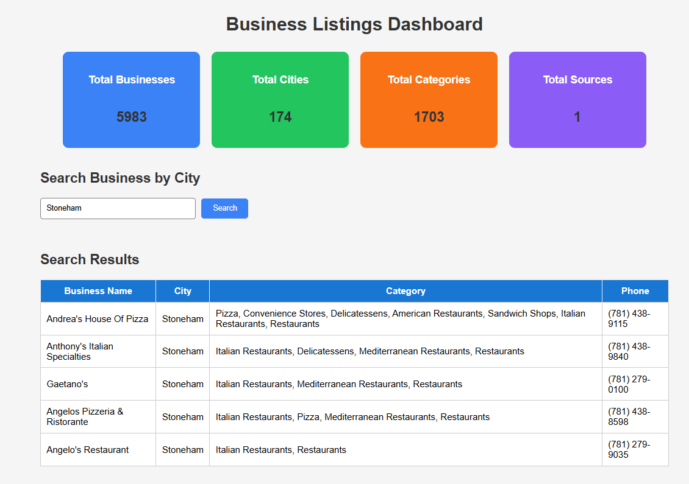
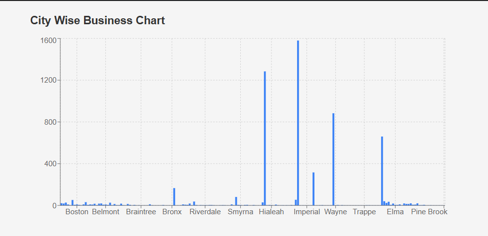
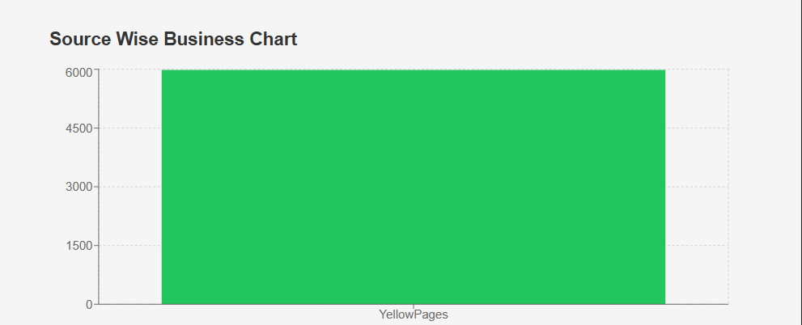
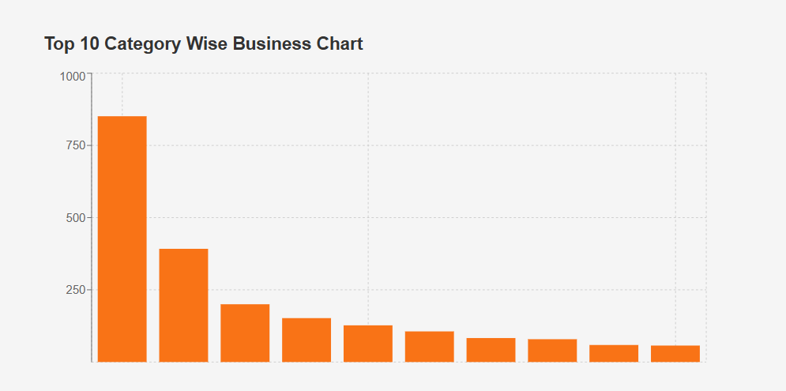

# Business Listings Dashboard

A full-stack web application built using **React.js**, **FastAPI**, and **MySQL**. The application stores business listings in a MySQL database and displays business information using charts and tables.

---

## Features

- Search businesses by city
- City-wise business count
- Category-wise business count
- Source-wise business count
- Dashboard summary cards
- Interactive charts
- MySQL database integration
- FastAPI REST APIs

---

## Tech Stack

### Frontend
- React.js
- Axios
- Recharts

### Backend
- FastAPI
- SQLAlchemy
- Uvicorn

### Database
- MySQL

### Web Scraping
- BeautifulSoup
- Requests

---

## Folder Structure

```
Business-Listings-Dashboard/
│
├── backend/
├── frontend/
├── scraper/
├── database/
├── Data/
├── docs/
└── README.md
```

---

## API Endpoints

| Method | Endpoint |
|---------|----------|
| GET | / |
| GET | /businesses |
| GET | /search?city=CityName |
| GET | /city-count |
| GET | /category-count |
| GET | /source-count |
| GET | /dashboard-summary |

---

## How to Run

### Backend

```bash
cd backend
pip install -r requirements.txt
uvicorn app:app --reload
```

### Frontend

```bash
cd frontend
npm install
npm run dev
```

---

## Dashboard Screenshots

### Dashboard



### City Wise Chart



### Source Wise Chart



### Category Wise Chart



---

## Author

**Anubhav Shukla**

GitHub: https://github.com/Anubhav-shukla05